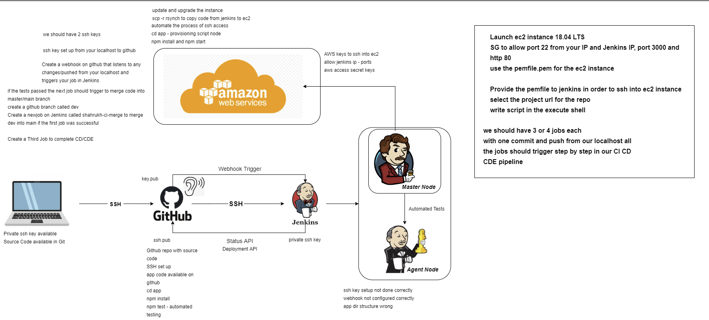

# CICD

## CICD Deployment to Jenkins
### Standard Set Up parts for all Jenkins Jobs
- First name the job using standard naming convention of yourname-whatthejobdoes
- Choose the type of job it is, generally select freestyle project if you are unsure
- Next select the discard old builds tickbox and set max builds to keep to 3, this saves memory on the server as you most likely won't look back at very old build
### Checking Githhub Code Job
- Once you have done the standard job setup, select the Github Project tickbox and add your https link to it
- Next set up the ssh keys to be able to interact with your repository
- For this navigate to your `.ssh` directory `cd ~/.ssh` should get you there
- Then run `ssh-keygen -t rsa -b 4096 -C "your@email"`, give the key a name and you can give it a passphrase
- For security a passphrase is good but can't be changed if you forget
- Next `cat` the `yourkey.pub` file and copy they key, as that is your public key
- Got to your github repo online, got to settings and then deploy keys
- Add a new key, give it a name and paste in your public key, allows write access then add key
- Return to Jenkins, go down to source code management and select git
- Copy in your SSH link from your repo
- Go back to your terminal and cat your `yourkey` and copy the private key
- Then add your credentials selecting SSH in jenkins, give it a name then select enter private key directly and paste in the key
- Select that SSH and change branches to build to your dev branch
- Next you need to return to your github repo settings again but go to webhooks
- Create a new one and in payload url past `http://ipofjenkinsserver:8080/github-webhook/` and change the content type to application/json
- Then for webhook triggers select individual events and choose push requests and pull requests, push should be on by default
- Return to Jenkins, got to build triggers then select GitHub hook trigger for GITScm polling tickbox
- Then go to build environment and select Provide Node & npm bin/ folder to PATH tickbox, you don't need to change anything here
- Go to Build and select execute shell and add
```
cd app
npm install
npm test
```
- This will test the code to ensure it is in working order
- Then post build action link to your merge with build other projects
### Merging Dev to Main Job
- Follow the steps of the previous job until the source code management section
- You will do the same bit at the beginning except add additional behaviour merge before build
- Set the repo name as origin and branch to merge to as main
- Then got to build triggers then select GitHub hook trigger for GITScm polling tickbox
- Got to post build actions, select Git Publisher and the merge results tickbox
- Then build other projects and link to your Deployment
### Deploying to AWS Job
